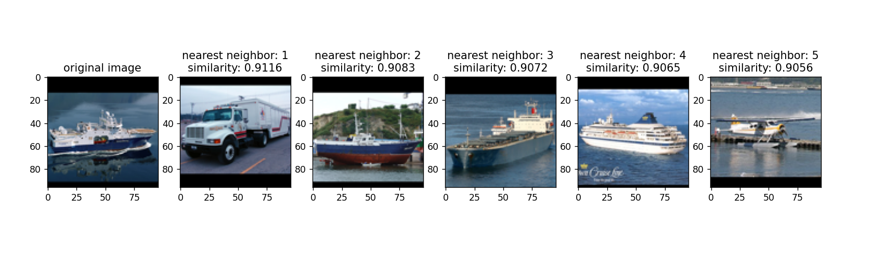
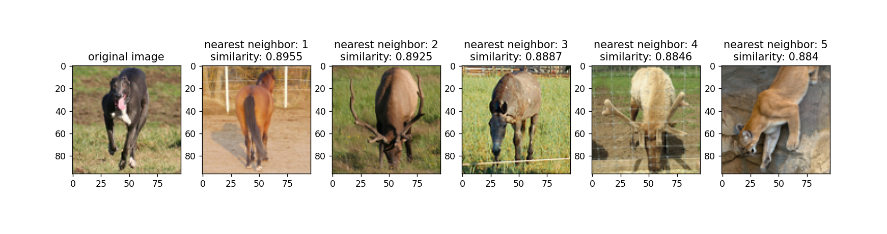
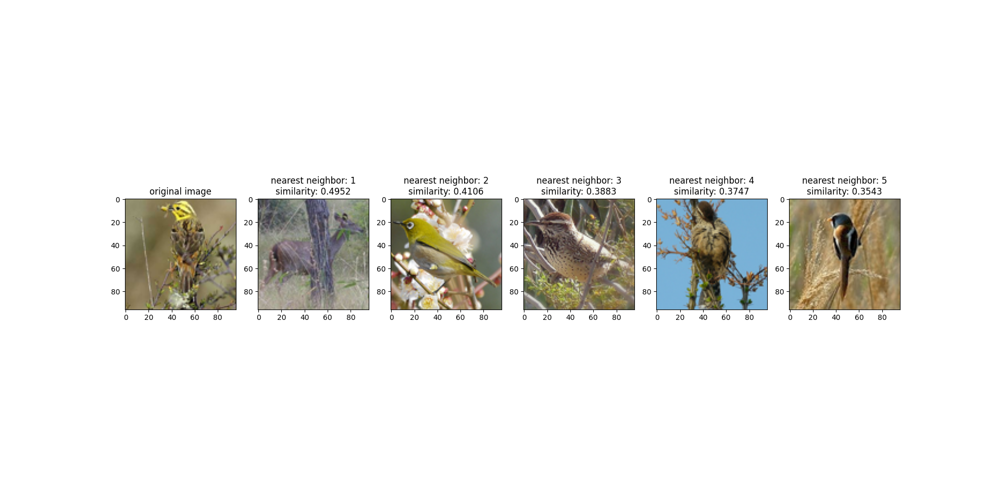
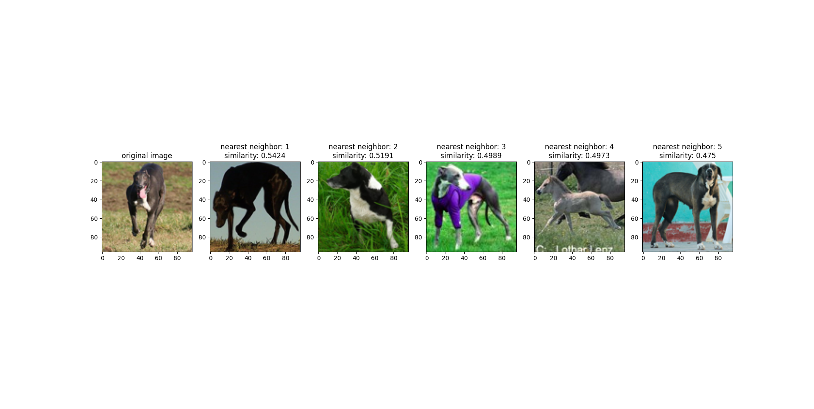
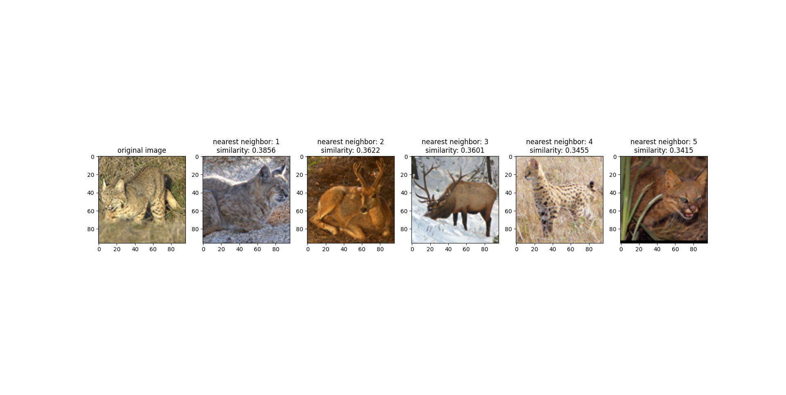
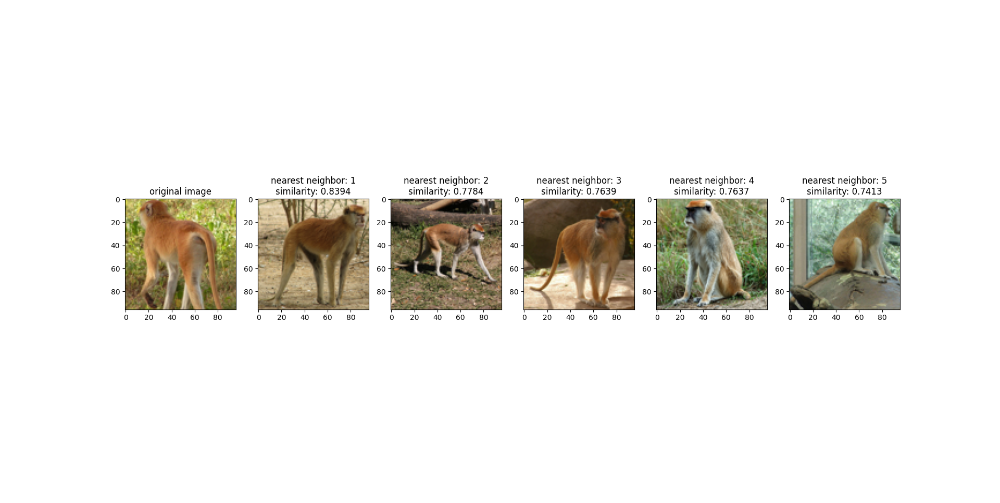
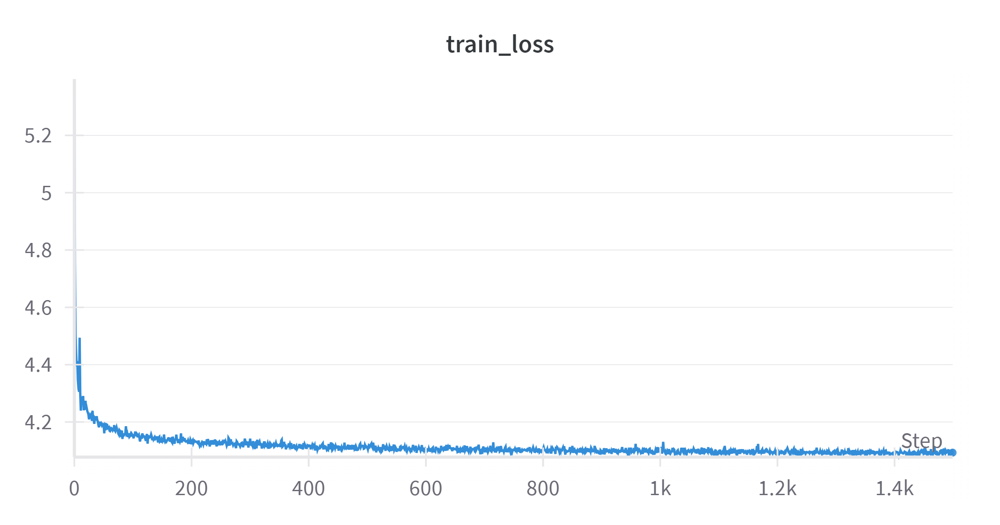

# How to evaluate: 
1. Train a model with SimClr
2. save the checkpoint
3. iterate through the dataset, for each sample find the closest samples using cosine similarity
4. Build a topk

# Iteration 1: 
Alexnet with STL10 dataset
* batch size: 256
* learning rate 0.1, using SGD with the annealing learning rate scheduler

# Evaluation results: 

* Best training loss after 20 epochs: 5
* Semantically such a high loss is a problem: 

    
    

The observations: 

* the model might be using the color as a shortcut. The solution would be to use heavier color transformations

* It is possible that all images are close to each others. As we can see the similarity measures are very close for the nearest 5 neighbors. One possible solution is to use the dot product instead of the cosine similarity. This can also be debugged by tracking the variance of similarities across training

* The paper authors use the LARS optimizer. The latter is claimed to be more suitable for large batch training. The learning rate is set to 0.3 * (batch size / 256). 
Using this setting might lead to more stable training

* easier ?? dataset
* different backbone maybe (Vision Transformer)

# Iteration 2: 

## Changes

* Using The Resnet50 feature Extractor instead of Alexnet
* training on the Caltech101 dataset; larger images resized to (200, 200)
* heavier color-based augmentations

## Results

The results are significantly better: 
    
    
    
    

The model started to learn more class-related features (beyond basic features such as the dominant color, the background...). The similarities to the nearest elements suggest that samples are not simply cluttered in a small minifold leading to a representation with very little discriminability.

The loss is still relatively high which leaves a lot of room for improvement. 

## Next steps

* Trying to scale images: using the same scaling transformation as the original Resnet50 architecture
* Using the Lars Optimizer

## Iteration 3
* debug KnnClassifier
* use Resnet101
* use the Lars Optimizer
* break down the loss and
* check if seeding the dataloaders implies returning the exact same sequence of batches in every epoch
